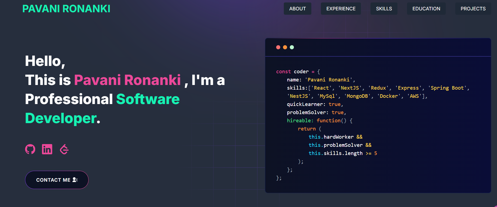

<p align="center" width="100%">
  
</p>

---

# [My Developer Portfolio](https://github.com/pavanironanki/developer-portfolio)

---

# Pavani Ronanki – Developer Portfolio 💻

A clean, modern, and customizable **personal portfolio website** built using **Next.js**, **TailwindCSS**, and **React**.  
Designed for developers and freelancers who want to showcase their projects, experience, and skills beautifully.

---

# 🎬 Demo



### 🔗 [Live Preview](https://pavanironanki.netlify.app/)

---

## 📚 Table of Contents

- [Sections](#sections)
- [Installation](#installation)
- [Getting Started](#getting-started)
- [Usage](#usage)
- [Deployment](#deployment)
- [Tutorials](#tutorials)
  - [Gmail App Password Setup](#gmail-app-password-setup)
  - [Create a Telegram Bot](#create-a-telegram-bot)
  - [Fetching Blog from dev.to](#fetching-blog-from-devto)
- [Packages Used](#packages-used)
- [FAQ](#faq)

---

## 🧩 Sections

- Hero Section  
- About Me  
- Experience  
- Skills  
- Projects  
- Education  
- Blog  
- Contact  

---

## 🛠️ Installation

### You’ll need to install the following:
- [Git](https://git-scm.com/downloads)
- [Node.js](https://nodejs.org/en/download/)

Check your versions:
```bash
node --version
git --version
